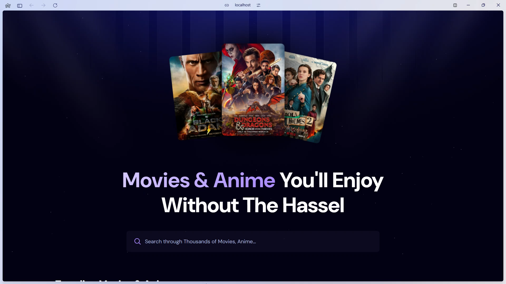
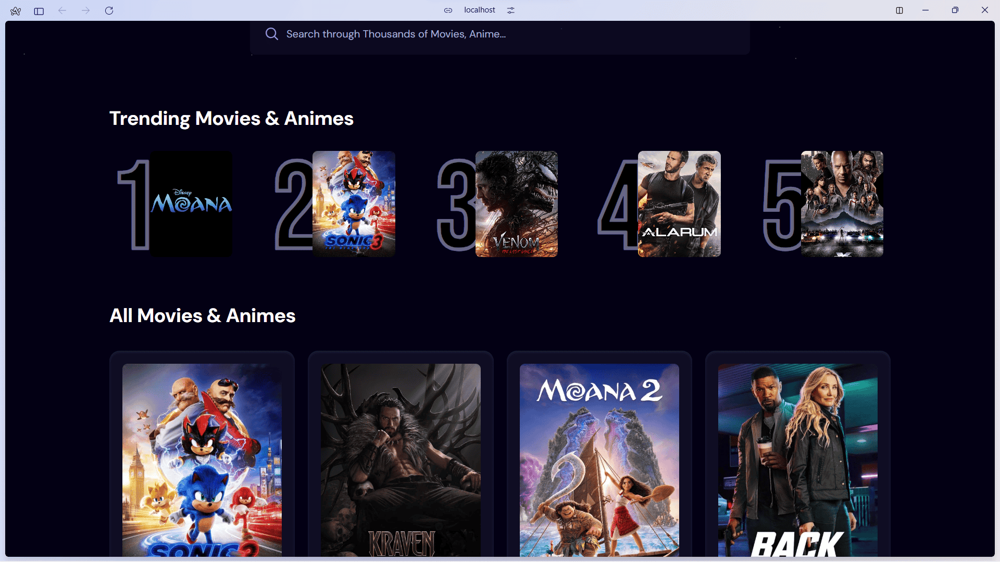
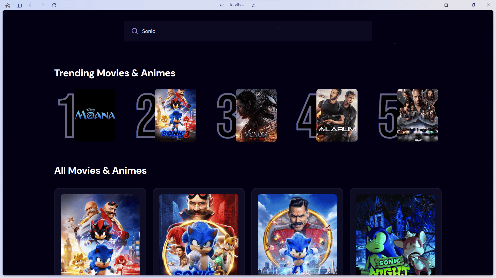
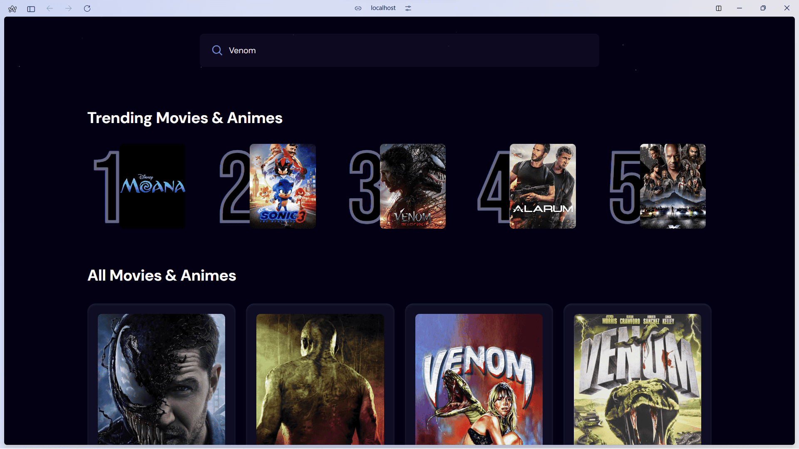

# 🎬 Live Movie Streaming App - React

  <div align="center">
    
    
    
  </div>

- I used this Project to Learn React & Tailwind CSS to Enhance my Knowledge in React Application.
- It uses API to fetch Live Real-Time Data & AppWrite for Optimise Trending Search.
- This Project Runs very well with Nice&Smooth Tailwind Css & Real-Time Data.
- Remember to Follow the Instructions Carefully to Make it Run.

---

<details>
  <summary align="center"><strong>Demo Images</strong> <p> (Click to Preview) </p></summary>
  <p align="center">
    
    
    
    
  </p>
</details>

## 📋 <a name="table">Table of Contents</a>

1. 🤖 [Introduction](#introduction)
2. ⚙️ [Tech Stack](#tech-stack)
3. 🔋 [Features](#features)
4. 🤸 [Quick Start](#quick-start)
## <a name="introduction">🤖 Introduction</a>

Built with React.js for the user interface, Appwrite for the Trending Movies Algorithm, and styled with TailwindCSS,  React-Streaming-App is a website project designed to help beginners get started with learning React.js. The platform offers a sleek and modern experience for browsing and discovering movies.


## <a name="tech-stack">⚙️ Tech Stack</a>

- React.js
- Appwrite
- Tailwind CSS

## <a name="features">🔋 Features</a>

👉 **Browse All Movies**: Explore a wide range of movies available on the platform.

👉 **Search Movies**: Easily search for specific movies using a search function.

👉 **Trending Movies Algorithm**: Displays trending movies based on a dynamic algorithm.

👉 **Modern UI/UX**: A sleek and user-friendly interface designed for a great experience.

👉 **Responsiveness**: Fully responsive design that works seamlessly across devices.

and many more, including code architecture and reusability

## <a name="quick-start">🤸 Quick Start</a>

Follow these steps to set up the project locally on your machine.

**Prerequisites**

Make sure you have the following installed on your machine:

- [Git](https://git-scm.com/)
- [Node.js](https://nodejs.org/en)
- [npm](https://www.npmjs.com/) (Node Package Manager)

**Cloning the Repository**

```bash
git clone https://github.com/Mr-Irtaza/React-Streaming-App.git
cd React-Streaming-APP
```

**Installation**

Install the project dependencies using npm:

```bash
npm install
```

**Set Up Environment Variables**

Create a new file named `.env.local` in the root of your project and add the following content:

```env
VITE_IMDB_API_KEY=

VITE_APPWRITE_PROJECT_ID=
VITE_APPWRITE_DATABASE_ID=
VITE_APPWRITE_COLLECTION_ID=
```

Replace the placeholder values with your actual **[TheMovieDatabase API](https://developer.themoviedb.org/reference/intro/getting-started)** and **[Appwrite](https://apwr.dev/JSM050)** credentials. You can obtain these credentials by signing up on the [TheMovieDatabase](https://developer.themoviedb.org/reference/intro/getting-started) and creating a new project on the [Appwrite](https://apwr.dev/JSM050)

**Running the Project**

```bash
npm run dev
```

Open [http://localhost:5173](http://localhost:5173) in your browser to view the project.

---

## 🐝 License
This project is open-source under the **MIT License**.

---

## 👨‍💻 Contributing
Feel free to fork this repository and submit a pull request with improvements! 😊

---

### 🌟 If you find this project helpful, consider giving it a ⭐ on GitHub!
